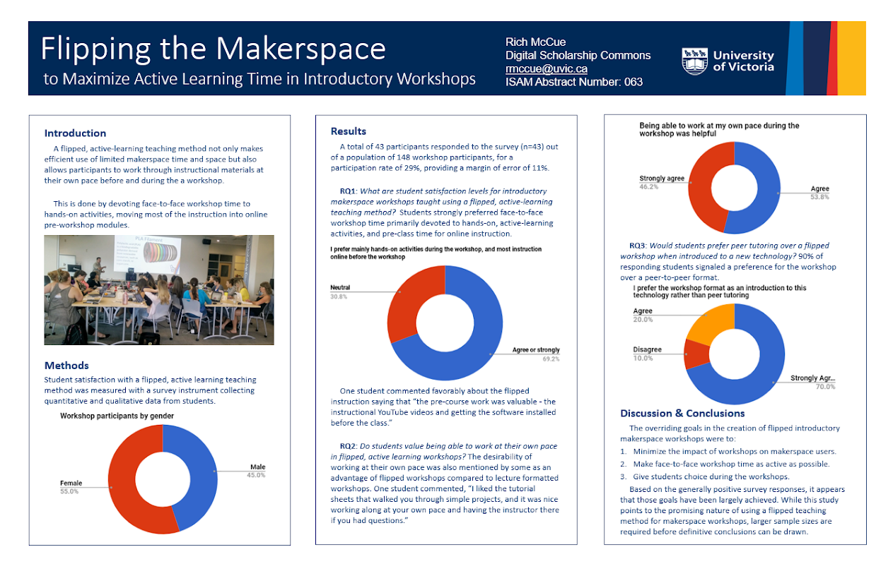
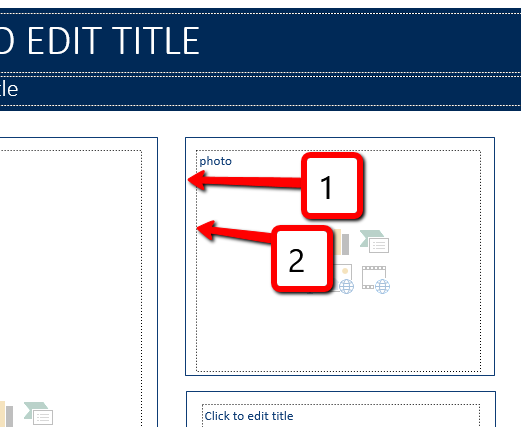

# Introduction to Academic Posters With The UVic PowerPoint Template

In this exercise, you will create an Academic Poster using PowerPoint 2016. If you have any questions or get stuck, please ask your instructor for assistance.

1.  Open PowerPoint & a Poster template:
    -   If you were able to find a conference poster template for your faculty during the pre-work for this workshop, open it now.
    -   If you don’t have a faculty template, please download and open the following [UVic template in PowerPoint.](https://web.uvic.ca/~rmccue/UVicEdge_ResearchPoster.pptx){:target="_blank"}
2.  Click on the **New Slide** button under the home tab and then select the first poster template with three columns.
3.  Confirm or change the size and orientation of your poster:
    -   Click on the **Design** tab in the top ribbon, and then on the far right click on the **Slide Size** drop-down, and then **Custom Slide Size...**
4.  Modify the template layout to suit the needs of your research project:
    -   Let’s start by changing the middle column from two blocks of text to one long block of text by clicking on the **View** tab on top of the ribbon, and then clicking on the **Slide Master** button.
    -   Next, select and delete the border around the middle top text box.
    -   Select and delete the middle top text box.
    -   Next, select the border around the middle bottom text box and drag it up so that it’s even with the other two columns.
    -   Select and stretch the middle text box up to match the other text boxes.
    -   Click on the **Close Master View** button on the right side of the ribbon. You’ll need to delete the text box and border in the regular view now.
5.  Add a title and subtitle in the two text blocks at the top of the poster.
    -   For example, if the title is long, you could put the first few words in the top title with the larger font: “Flipping the Makerspace:” and then the rest of the title on the line below with the smaller font: “to Maximizing Active Learning Time in Introductory Workshops.”
    -   You might want to consider adding a small text block into the title in order to add author, affiliation, and conference or event information. To do this go to the **Insert** tab, and then select the **Text Box** button on the ribbon. You will need to change the font colour to white using the tool on the **Home** tab.

    

6.  Copy and paste the summarized text into the poster columns, flowing from left to right, down columns, leaving room for the photos and/or charts you would like to include.
    -   Your poster needs to be readable at a distance so body text should be no smaller than 32 points, and your text should be black on a white or very light background.
    -   Use a serif font (e.g. Times New Roman) rather than a non-serif font (e.g. Ariel).

    

7.  Inserting & formatting pictures:
    -   Make sure the picture you would like to insert is on your laptop’s hard drive. Now select the **Insert** tab on the top menu, and then click on the **Pictures** button. Navigate to find the photo on your computer and press the **Insert** button.
    -   Drag the photo to the location on your poster where you would like it to sit, then resize the photo and make sure you’ve left enough space for a caption below the photo. Insert a text box for a caption below the photo (see step 5b for how to insert a new text box).
    -   Ideally, you edit your photos before importing them into PowerPoint, but if you need to do some minor editing in PowerPoint, right-click on the image and then select **Format Picture…**  Next click on the image icon (see graphic to the right), and then experiment changing the Sharpness, Brightness, Contrast, Saturation, and Temperature.

    

8.  Inserting charts:
    -   Make sure your chart is exported or saved from Excel (or other data analysis software) on your computer in JPG or PNG format.
    -   Select the **Insert** tab on the top menu, and then click on the **Pictures** button. Navigate to find the chart on your computer and press the **Insert** button.
    -   Drag the chart to the location on your poster where you would like it to sit. You made need to make space in your text by pressing your enter key a number of times.
    -   Resize the chart and make sure you’ve left enough space for a caption below it. Insert a text box for a caption below the chart (see step 5b for how to insert a new text box).
9.  Final formatting tip for your poster: Make sure your poster is balanced across your three columns with text, photos, and charts.
0.  You can print your poster at Blink Copy in the basement of the campus book store.

    

[NEXT STEP: #BetterPoster Activity](act-2.html){: .btn .btn-blue }
