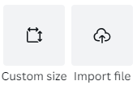
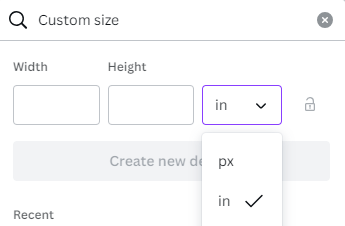
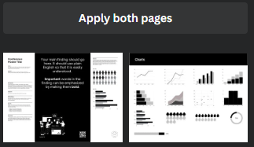

# Find a Template on Canva

In this exercise, you will create an Academic Poster using Canva. If you have any questions or get stuck, please ask your instructor for assistance. 

1.  Create a Canva account at 
[canva.com](https://ww.canva.com/){:target="_blank"}  
   
2.  Click on the Create a design button on the top right of the screen.  
    - At the bottom of the drop-down that comes up, there is a button for “Custom size”. Click on this to bring up sizing options. 
    - This will bring up the Custom Size options. Click on the little drop down for units (default is “px” for pixels) and change it to “in” for inches.  
    - Type in 48 for Width and 36 for Height (**Note: starting with this size will bring up the most results in the Canva templates search**, and is a common academic poster size. If you need another size, please see our resizing tips later after selecting a template.) and then click Create new design. This will open a new tab with a blank canvas to start working in. 

3. Choose a template: 
   - You should have templates showing in the left sidebar with a Search field at the top. Type “Research posters” in the search field to bring up template ideas. 
   - Scroll through to find a template you like. If you mouse over them, you may notice that many of them will start to move like a slideshow, indicating multiple pages. These extra pages are just there to provide extra, optional matching content that fit the theme of the template (e.g., charts and graphs and/or graphics and text boxes) that you can move to your main page if you need them.  
    - Once you find a template you like, click on it. If it has multiple pages, it will ask if you want to apply the other pages. Click the “apply both/all pages” button. You can discard the extra pages when you are finished designing your poster.  

   

[NEXT STEP: Customize Your Poster Activity](act-2.html){: .btn .btn-blue }
