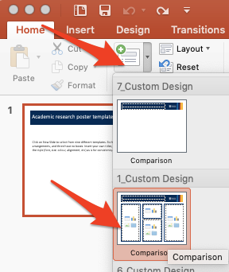
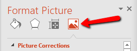
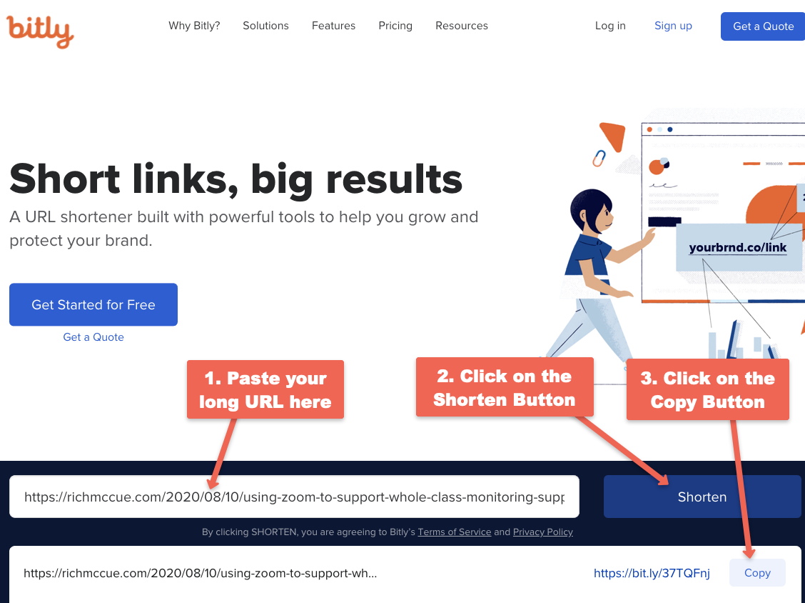
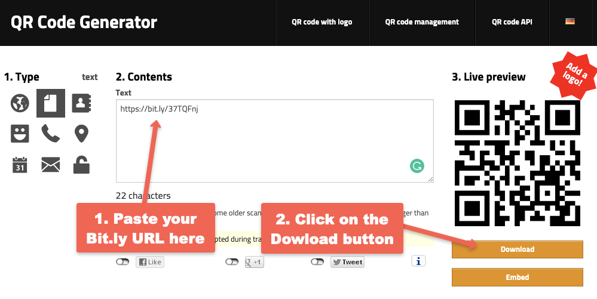

# Introduction to Academic Posters With The #BetterPoster Template

In this exercise, you will create an Academic Poster using PowerPoint and the #BetterPoster template. If you have any questions or get stuck, please ask your instructor for assistance.

1.  Open PowerPoint & a Poster template:
    -   If you were able to find a conference poster template for your faculty during the pre-work for this workshop, open it now.
    -   Here is the [#BetterPoster Template](https://web.uvic.ca/~rmccue/betterposter-template.pptx){:target="_blank"} for you to download and use.
2.  Confirm or change the size and orientation of your poster:
    -   Click on the **Design** tab in the top ribbon, and then on the far right click on the **Slide Size** drop-down, and then **Custom Slide Size...**
    -   The template’s default poster size is 54” x 36” (or 137.16 x 91.44 cm) which should be ok for most academic posters.

    

3.  Add a title and subtitle in the two text blocks at the top left of the poster.
    -   For example, if the title is long, you could put the first few words in the top title with the larger font: “Flipping the Makerspace:” and then the rest of the title on the line below with the smaller font: “to Maximizing Active Learning Time in Introductory Workshops.”
    -   You might want to consider adding a small text block into the title in order to add author, affiliation, and conference or event information. To do this go to the **Insert** tab, and then select the **Text Box** button on the ribbon. You will need to change the font colour to white using the tool on the **Home** tab.
4.  Copy and paste the summarized text into the poster columns, flowing from left to right, down columns, leaving room for the photos and/or charts you would like to include.
    -   Your poster needs to be readable at a distance so body text should be no smaller than 32 points, and your text should be black on a white or very light background.
    -   If you are printing your poster use a serif font (e.g. Times New Roman). If your poster will be online only, then use a non-serif font (e.g. Ariel).

    

5.  Inserting & formatting pictures:
    -   Make sure the picture you would like to insert is on your laptop’s hard drive. Now select the **Insert** tab on the top menu, and then click on the **Pictures** button. Navigate to find the photo on your computer and press the **Insert** button.
    -   Drag the photo to the location on your poster where you would like it to sit, then resize the photo and make sure you’ve left enough space for a caption below the photo. Insert a text box for a caption below the photo (see step 5b for how to insert a new text box).
    
        
    
    -   Ideally, you edit your photos before importing them into PowerPoint, but if you need to do some minor editing in PowerPoint, right-click on the image and then select **Format Picture…**  Next click on the image icon (see graphic to the right), and then experiment changing the Sharpness, Brightness, Contrast, Saturation, and Temperature.
6.  Inserting charts:
    -   Make sure your chart is exported or saved from Excel (or other data analysis software) on your computer in SVG, JPG, or PNG format (SVG is the preferred format).
    -   Select the **Insert** tab on the top menu, and then click on the **Pictures** button. Navigate to find the chart on your computer and press the **Insert** button.
    -   Drag the chart to the location on your poster where you would like it to sit. If you need to make space in your text, press your enter key a number of times.
    -   Resize the chart and make sure you’ve left enough space for a caption below it. Insert a text box for a caption below the chart (see step 5b for how to insert a new text box).
7.  Add a QR Code to your poster that links to your research paper or report:
    -   Start by copying the URL of your academic paper from your web browser (assuming it is available online somewhere).
    -   Next we need to shorten the URL to your blog post so that the dots on the QR code you create aren’t too small for cameras to read.
    -   You can do this by going to [Bit.ly](https://bit.ly){:target="_blank"} then paste your URL into the **Shorten your link** field and pressing the blue **Shorten** button - see graphic below (you don’t need to set up an account to do this unless you want to track the number of people going to your paper).
    
        
    
    -   Create the QR Code for your poser by copying the short Bit.ly URL you just created and going to the [QR Code Generator](http://goqr.me/){:target="_blank"}.
        -   Paste your Bit.ly URL into the text field.
        -   Click on the download button.
    
        
    
    -   Select the **Insert** tab on the top menu, and then click on the **Pictures** button. Navigate to find the QR Code image on your computer and press the **Insert** button.
    -   Drag the QR Code to the location on your poster where you would like it to sit, then resize it.
8.  Final formatting tip for your poster: Make sure your poster is balanced across your three columns with text, photos, and charts.
9.  You can print your poster at Zap Copy in the student union building: [https://zapcopy.com/printing/](https://zapcopy.com/printing/){:target=_blank"}

    

[NEXT STEP: Quick Tips](tips.html){: .btn .btn-blue }
