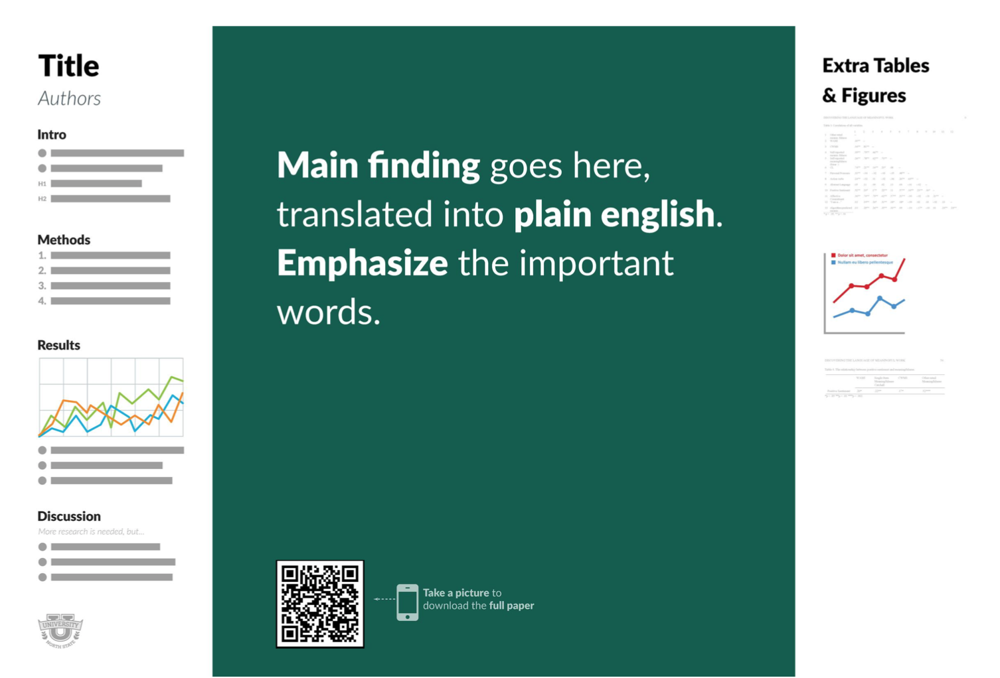

# Academic Posters - Quick Tips

&nbsp;&nbsp;&nbsp;&nbsp;&nbsp;**Getting Started**

1.  An effective poster is a visual communications tool. It:
    -   Focuses on a single message.
    -   Let graphics and images tell the story using text sparingly.
    -   Keeps the sequence well-ordered and obvious.
2.  What is the most important or interesting finding from your research project?
3.  An academic poster is not a research paper stuck to a board; it shows, not tells, your research story.

     
    **Define Your Message**

4.  What is the one thing you want your audience to learn?
5.  Your “one thing” should be supported by a compelling combination of images, charts, and short blocks of text.
6.  Focus on your message throughout the poster. If something is interesting but doesn’t reinforce your message, then leave it out!
7.  If you have an interesting result, state it explicitly in your title.
8.  Space is tight, so rather than repeating the results, state your interpretations in the conclusion section.

     
    **Know Your Audience**

9.  General audience? If so, they won’t have any familiarity with your subject area – avoid the use of jargon, use basic descriptions only.
0.  If you’re presenting for an audience in your field, it’s okay to use jargon and technical terms.

     
    **Design and Layout Tips**

1.  Start with a Template. UVic has <a href="" download>Academic Poster templates available for use</a> (download). Here’s an article to help inspire you to tell a story and draw people into a conversation about the main findings of your paper: [http://bit.ly/better-posters](http://bit.ly/better-posters){:target="_blank"}
2.  Make sure your poster meets the guidelines for the event at which it will be displayed.
3.  All important information should be visible from 3m (10ft) away. Don’t put too much text on your poster!
4.  Your Title and Main finding should be short and draw interest (Academic titles often are not good at drawing interest). DON’T USE ALL CAPS. If you have an interesting finding, include it in your title.
5.  Make sure that your key point is obvious.
6.  Use headlines, font size, bullets, and numbering to help organize your poster.

     
    **Categories of Information to Include**

7.  Title (Short eye catching & concise)
8.  Introduction or context (but not your abstract – the poster is in itself an abstract of your research)
9.  Materials/methods/theory
0.  Results
1.  Conclusions
2.  Citations, Acknowledgments (including awards & funding), & Institutional affiliation and contact information

     
    **Photo and Chart Considerations**

3.  Make sure all your photos and charts are visible from 3m away.
4.  Images copied from the web are typically low resolution and are not of high enough quality for a printed poster.
5.  If you have graphs or charts from Excel, simply copy and paste into Powerpoint.
6.  Do not enlarge images after they have been inserted into Powerpoint.
7.  Where to get high-resolution Creative Commons licensed photos?
    -   [Unspash.com](https://unsplash.com){:target="_blank"}
    -   [Pexels.com](https://www.pexels.com/){:target="_blank"}
    -   [Create Biology figures](http://BioRender.com){:target="_blank"}
    -   [Full colour clip art with transparent background](https://vectorstock.com){:target="_blank"}
    -   [Free icons to help describe your research story](https://thenounproject.com){:target="_blank"}
    -   [Google Advanced Image Search](https://www.google.ca/advanced_image_search){:target="_blank"}
    -   [CreativeCommons image search](https://search.creativecommons.org/){:target="_blank"}
8.  Don’t forget to provide captions for your graphics & photos.
9.  You can crop your images and charts directly in PowerPoint.

     
    **Copyright Issues For Images**

0.  Published images and charts are all subject to copyright law, so you can’t simply use images you find on the Internet or through Google image search. Generally speaking images you may want to use for your poster fall under one of the following categories:
    -   Public domain - you can use and modify public domain images as you see fit. Please consult a copyright librarian or online resource to determine the copyright status of an image. Example: [UVic’s Copyright Resource.](https://www.uvic.ca/library/featured/copyright/support/resources/index.php){:target="_blank"}
    -   Creative Commons - you can usually use and modify Creative Commons licensed images providing you include the appropriate citation. See the previous section for websites and search engines that help you find Creative Commons licensed images.
    -   Copyright - you can only use and/or modify copyrighted images with explicit permission from the copyright holder, for a specified purpose and often only after paying a fee. NOTE: If you have taken a picture yourself or created a chart or graphic, you own the copyright to those works and can use them as you see fit.

     
    **References and Resources**

-   [https://www.uvic.ca/learningandteaching/faculty/resources/instructional/academicposters/index.php](https://www.uvic.ca/learningandteaching/faculty/resources/instructional/academicposters/index.php){:target="_blank"}
-   [https://libguides.viu.ca/ld.php?content_id=34280072](https://libguides.viu.ca/ld.php?content_id=34280072){:target="_blank"}
-   [http://duspviz.mit.edu/tutorials/adobe-indesign-posters/](http://duspviz.mit.edu/tutorials/adobe-indesign-posters/){:target="_blank"}
-   [http://www.materials.ox.ac.uk/uploads/file/postgrads/Posters%20-%20skills%20workshop%20(Baker,%202012).pdf](http://www.materials.ox.ac.uk/uploads/file/postgrads/Posters%20-%20skills%20workshop%20(Baker,%202012).pdf){:target="_blank"}
-   [https://www.slideshare.net/blueskiesbroken/workshop-designing-effective-poster-presentations](https://www.slideshare.net/blueskiesbroken/workshop-designing-effective-poster-presentations){:target="_blank"}
-   [https://www.slideshare.net/researchcenterm/poster-workshop-48532332](https://www.slideshare.net/researchcenterm/poster-workshop-48532332){:target="_blank"}
-   [https://guides.nyu.edu/c.php?g=276826&p=1846156](https://guides.nyu.edu/c.php?g=276826&p=1846156){:target="_blank"}
-   [https://projects.ncsu.edu/project/posters/](https://projects.ncsu.edu/project/posters/){:target="_blank"}
-   [https://library.ryerson.ca/copyright/resources/general-copyright-information/copyright-basics/](https://library.ryerson.ca/copyright/resources/general-copyright-information/copyright-basics/){:target="_blank"}

[NEXT STEP: Earn a Workshop Badge](informal-credentials.html){: .btn .btn-blue }
